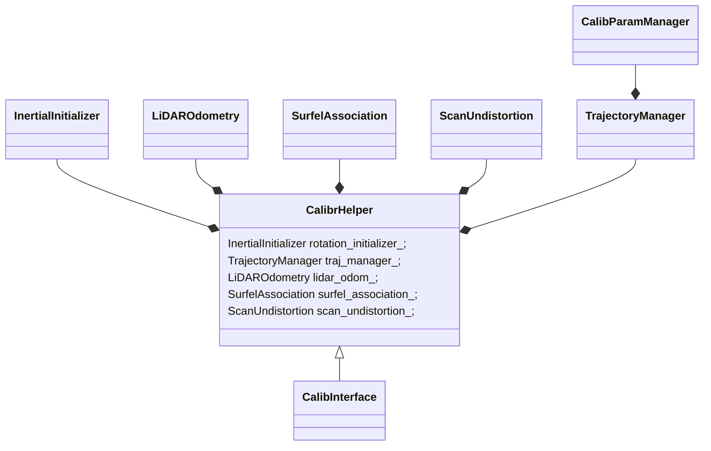
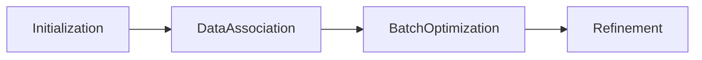
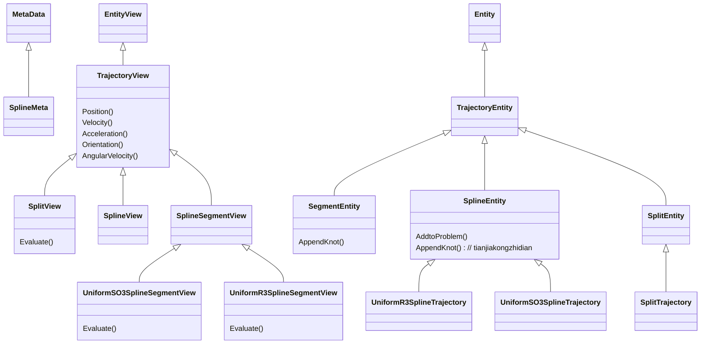

# li_calib_gui

## 启动方式

```bash
cd ~/catkin_ws
source devel/setup.sh
./src/lidar_IMU_calib/calib.sh
```

## 类图



- CalibrHelper
  1. 包含一个`ros::NodeHandle`，处理ros相关
  2. 通过`IO::LioDatase`读取bag包数据
  3. 定义了主要流程

- CalibInterface
  1. 定义和pangolin相关的按钮，相机视角等
  2. `renderingLoop`是渲染的主要函数

## 流程图

具体实现流程见` src/ui/calib_helper.cpp`



- Initialization
  1. 将数据包中所有imu数据加入到`traj_manager_`中，求解优化器
  2. 将数据包中所有lidar数据加入到`lidar_odom_`中，
  3. 利用`rotation_initializer_`求解超定方程，初步计算lidar到imu的旋转四元数
- DataAssociation
  1. 
- BatchOptimization
- Refinement

## test/li_calib_gui.cpp

通过CMakeLists.txt可以看到入口文件为`test/li_calib_gui.cpp`

```c++
ros::NodeHandle n("~");
CalibInterface calib_app(n);
calib_app.renderingLoop();
```

## ui

### CalibHelper

> include/ui/calib_helper.h && src/ui/calib_helper.cpp

`CalibHelper`定义是

### CalibInterface

> include/ui/calib_ui.h   &&  src/ui/calib_ui.cpp

## core


### LiDAROdometry

> include/core/lidar_odometry.h  && src/core/lidar_odometry.cpp

激光雷达里程计通过ndt进行点云匹配，记录关键帧

- feedScan

  输入当前帧点云, 与全局地图进行配准，得到位姿加入odom_data_，如果是关键帧则加入全局地图中

- registration

  调用ndt_map_进行点云匹配，得到位姿估计存入pose_out

- updateKeyScan

  如果是关键帧，将点云下采样后加入map_cloud_

- checkKeyScan

  当姿态角变动比较大时，确定为关键帧

### SurfelAssociation

> include/core/surfel_association.h

### InertialInitializer

> include/core/inertial_initializer.h && src/core/inertial_initializer.cpp

### TrajectoryManager

> include/core/trajectory_manager.h &&src/core/trajectory_manager.cpp

内部调用kontiki进行轨迹优化，kontiki内部调用ceres

- feedIMUData

  向`imu_data_`添加数据

- initialSO3TrajWithGyro

  根据`SO3TrajEstimator`求解，初始化初始化旋转轨迹

- addGyroscopeMeasurements

  将`imu_data_`观测加入到传入的estimator中

#### CalibParamManager

> include/core/calibration.hpp

`CalibParamManager`类由`TrajectoryManager`存储，记录标定的结果，包括

- q_LtoI

  lidar到imu的旋转四元数

- p_LinI

  lidar到imu的位移

- time_offset

  lidar和imu的时间差

- gravity

  imu的重力

- gryo_bis && acce_bias

  imu的偏置

## Kontiki

### TrajectoryEstimator

> include/kontiki/trajectory_estimator.h

内部封装一个`ceres::Problem`，用来进行优化

### measurements

定义一个`Residual`类，计算观测和预测的差，提供一个`AddToEstimator`类，将误差项加入优化目标

- AccelerometerMeasurement

  借用`ConstantBiasImu`和`UniformSO3SplineSegmentView`计算误差

- gyroscope_measurement

  同上

- lidar_surfel_point

  利用面元投影计算误差（也需要用到trajectory）

- LiDARPositionMeasurement

  误差计算是和uniform_r3_spline_trajectory提供的Evalute计算出来的插值

### sensors

这里面的类设置待优化的变量，提供一个`AddToProblem`，内部使用`problem.AddParameterBlock`将变量加入`ceres::Problem`中

- Sensor

  最基础的传感器，定义传感器的位置，姿态，time_offset

- ConstantBiasImu

  增加了加计和陀螺仪的bias，并提供了加计和陀螺仪的递推过程

- PinholeCamera

  增加了相机的内参（不是优化变量），提供相机投影和反投影

  `EvaluateProjection`

- VLP16Lidar

  没有额外实现任何功能，只是调用基类

### trajectories

<u>**可以将trajectories理解为一种特殊的sensors**</u>

通过`Evaluate`函数和观测一起计算误差

`SplitTrajectory`实际上是`UniformR3SplineTrajectory`和`UniformSO3SplineTrajectory`合并起来的



<u>注意看`include/kontiki/trajectories/spline_base.h`，这里提供了`AddToProblem`的具体实现，首先找到控制点，之后将关联的控制点添加到待优化的参数上。</u>

`include/kontiki/trajectories/uniform_so3_spline_trajectory.h`和`include/kontiki/trajectories/uniform_r3_spline_trajectory.h`提供了Evaluate用来在样条线约束下推导轨迹。


